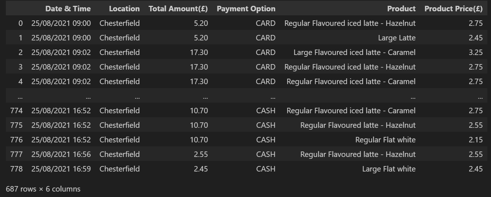

# Pandas-Megaprojects

## Overview

A collection of all Pandas Projects in one place. All projects are personal projects and all CSV files are taken from open sources websites such as Kaggle.  

## Fifa Project 

### Background
I've been tasked with refining and reformatting a raw CSV file that holds all player data for FIFA 21, as requested by EA. This entails cleansing and restructuring the data to prepare it for upload into an AWS S3 bucket. The objective is to retain specific metrics as outlined by EA, such as height in centimeters, and to filter out players not affiliated with Premier League clubs.

### Working
Utilizing Pandas in Juypter Notebook, I was successful in:
1. Dropping irrelevant or sensitive columns.
2. Renaming columns.
3. Filtering for Premier League clubs.
4. Removing (\n,€,K,cm,") from records in the Club, Value, Wage, and Height columns.
5. Converting Wage from string with K to floats, i.e., 300k to 300000.
6. Converting Value from string with K and M to floats, i.e., 300k to 300,000, 3M to 3,000,000.
7. Converting Height from feet to cm, i.e., 5'9 to 175.

### Table
A preview of the final cleaned and transformed table:

## Cafe Project 

### Background

I've been assigned a task by a national chain of pop-up cafes to refine and restructure a raw CSV file encompassing all purchases made during a day of business. My responsibilities include purging sensitive data, eliminating duplicates and null values, reorganizing select columns for better comprehension, and implementing additional improvements as needed.

### Working 

Utilizing Pandas in Juypter Notebook, I was successful in:
1. Dropping irrelevant or sensitive columns.
2. Renaming columns.
3. Removing duplicate records.
4. Removing rows with missing value.
5. Splitting whole order into seperate rows.
6. Splitting Product and Price into seprate colomns.

### Table
A preview of the final cleaned and transformed table:
